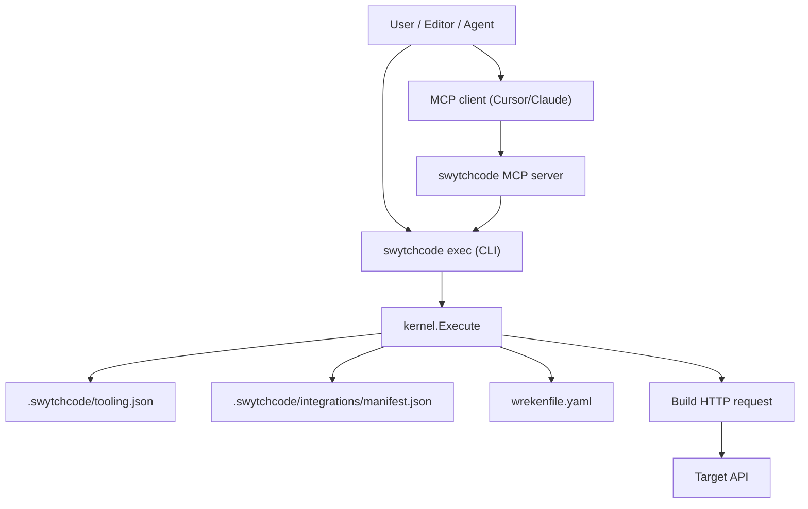

# Swytchcode CLI – Architecture Overview

Swytchcode is a **secure execution layer** for AI agents and CLIs. Editors and agents are guests; only `swytchcode exec` actually runs tools. This document describes the main components and how they fit together.

## Top-level layout

- `cmd/swytchcode/` – Binary entrypoint; calls `internal/cli.Execute()`.
- `internal/cli/` – CLI surface (Cobra commands), flags, and user-facing behavior.
- `internal/kernel/` – Pure execution engine: resolves tools, validates input, builds HTTP requests, and runs them.
- `internal/registry/` – HTTP client for the Swytchcode registry API (used by `search`, `get`, `bootstrap`).
- `internal/manifest/` – Manages `.swytchcode/integrations/manifest.json` (endpoints, counts, auth metadata).
- `internal/commands/` – Shared application logic reused by CLI and MCP tools (e.g. `RunGet`, `RunBootstrap`, `RunCheck`).
- `internal/mcp/` – MCP server implementation and tool registrations.
- `internal/editors/` – Editor integration helpers (Cursor, Claude) and embedded templates.
- `internal/auth/`, `internal/telemetry/`, `internal/util/` – Auth/session management, telemetry events, and general utilities.
- `internal/constants/` – Shared constants (timeouts, registry URL, version, MCP defaults).
- `pages/` – GitLab Pages landing page (install one-liner, links to releases, wiki, docs).
- `scripts/` – CI helper scripts (e.g. `auto_tag.sh` for semantic version tags).
- `docs/` – Technical documentation ([architecture.md](architecture.md), [execution-model.md](execution-model.md), [config-spec.md](config-spec.md), [cli-reference.md](cli-reference.md), etc.).

## High-level data flow

At a glance:

- **CLI** and **MCP** both funnel requests into `kernel.Execute`.
- The kernel is **offline-capable**: it uses only local files (`tooling.json`, integration bundles, `manifest.json`) and never calls the registry at exec time.
- The **registry client** is only used by commands such as `search`, `get`, and `bootstrap` to populate `.swytchcode/integrations/`.

## CLI layer (`internal/cli/`)

The CLI is built with Cobra. The root command is defined in [`internal/cli/root.go`](internal/cli/root.go):

- Registers subcommands: `init`, `get`, `add`, `exec`, `bootstrap`, `list`, `search`, `info`, `mcp`, `check`, `login`, `logout`, `whoami`, `inspect`, `upgrade`.
- Sets `Version` from `internal/constants.Version`, which is overridden by Goreleaser at build time.

Key commands:

- **`exec`** (`internal/cli/exec.go`):
  - Accepts either:
    - CLI args: `swytchcode exec <canonical_id> [flags]`.
    - JSON on stdin: `{"tool":"<canonical_id>","args":{...}}`.
  - Normalizes CLI flags (body file, `--input`, `--param`, `--header`) into the JSON `args` map.
  - Calls `kernel.Execute` with stdin/stdout/stderr and flags for `--allow-raw`, `--dry-run`, `--raw`, and `--json`.

- **`init`** (`internal/cli/init.go`):
  - Creates `.swytchcode/` directory structure and `tooling.json`.
  - Calls `internal/editors` helpers to install Cursor / Claude templates when an editor is selected.

- **`get`** (`internal/cli/get.go`) and **`bootstrap`** (`internal/cli/bootstrap.go`):
  - Thin wrappers that call shared logic in `internal/commands/get.go` and `internal/commands/bootstrap.go`.
  - These commands contact the **registry** to fetch bundles and populate `.swytchcode/integrations/`.

- **Auth-related commands** (`login`, `logout`, `whoami`, `check`, `inspect`, `upgrade`):
  - Use `internal/auth` to manage user sessions or service tokens.
  - Talk to the backend at `SWYTCHCODE_API_URL` (default `https://api-v2.swytchcode.com`).
  - Use `internal/telemetry` to report usage events.

## Kernel (`internal/kernel/`)

The kernel is responsible for deterministic, policy-respecting execution. Its main entrypoint is [`kernel.Execute`](internal/kernel/executor.go):

- **ExecRequest** (`executor.go`):
  - JSON shape: `{ "tool": "<canonical_id>", "args": { ... } }`.

- **Execution pipeline** (`executor.go` comments and implementation):
  1. Read stdin and parse JSON into [`ExecRequest`](internal/kernel/executor.go) (`io.ReadAll` + `json.Unmarshal`; see [execution-model.md](execution-model.md)).
  2. Detect project root (via `util.ProjectRoot`) if not provided.
  3. Enforce raw method policy (`raw.` prefix requires `--allow-raw`).
  4. Resolve tool from `tooling.json` via [`ResolveTool`](internal/kernel/resolver.go).
  5. Load integration bundle (Wrekenfile + methods/workflows) via [`LoadIntegrationBundle`](internal/kernel/bundle.go).
  6. Resolve method/workflow from Wreken `METHODS` section via [`ResolveMethod`](internal/kernel/bundle.go).
  7. Resolve base URL from `manifest.json` via [`GetBaseURL`](internal/kernel/manifest.go) based on mode (`production`/`sandbox`).
  8. Validate the base URL via [`ValidateExecutionBaseURL`](internal/kernel/base_url_validate.go): `https://` for any host, or `http://` only for loopback (`localhost`, `127.0.0.1`, `::1`).
  9. Validate input schema via [`ValidateInput`](internal/kernel/validator.go).
  10. Build HTTP request via [`BuildRequest`](internal/kernel/request.go).
  11. Execute (or dry-run) and normalize output:
      - Raw: `OutputRawResponse`.
      - JSON: `OutputJSONResponse`.

- **Tool resolution** (`resolver.go`):
  - Reads `.swytchcode/tooling.json` via [`util.LoadToolingJSON`](internal/util/tooling.go) (shared with commands that mutate or inspect tooling).
  - Finds the tool in `tooling.json.tools[canonical_id]`.
  - Extracts:
    - `integration` (string like `project.library@version`).
    - `type` (`method` or `workflow`).
    - `summary`, `desc`, `inputs`.
    - `mode` from top-level `tooling.json.mode` (defaults to `production`).

- **Manifest integration** (`manifest.go` in `internal/kernel/` + `internal/manifest/manifest.go`):
  - Uses `manifest.Read(projectRoot)` to load `.swytchcode/integrations/manifest.json`.
  - `GetBaseURL` selects `sandbox_endpoint` or `production_endpoint` for the relevant integration, based on the tool’s mode.

- **Error handling & logging** (`errors.go`):
  - Defines **public** exit codes:
    - `ExitCodeOK = 0`
    - `ExitCodeInvalidInput = 1`
    - `ExitCodeToolNotFound = 2`
    - `ExitCodeAuthError = 3`
    - `ExitCodeSDKFailure = 4`
    - `ExitCodeInternalError = 5`
  - Writes normalized JSON errors to stderr: `{ "error": "message" }`.
  - Logs sanitized request args and failures for observability (used by CLI and MCP).

## Registry client (`internal/registry/`)

The registry client is used only when fetching or searching for integrations:

- [`config.go`](internal/registry/config.go):
  - Holds registry configuration (base URL derived from `constants.RegistryURL`).

- [`client.go`](internal/registry/client.go):
  - Configures an `http.Client` with timeouts and connection pool settings from `internal/constants`.
  - Provides `Get` and `Post` helpers using `Config.APIBasePath()`.

- [`api.go`](internal/registry/api.go):
  - Defines types and higher-level calls:
    - `ListWorkflows`, `ListMethods`, `GetIntegrationBundles`, etc.
  - `FillEmptyWorkflowNames` and related helpers normalize API responses.

The **kernel never calls the registry**. Only `get`, `bootstrap`, and `search` use this client to populate or query integration metadata.

Registry `Get`/`Post` call [`checkInsecureBlockedInCI`](internal/registry/insecure.go) first: when `SWYTCHCODE_INSECURE=1` and CI env vars (`CI`, `GITHUB_ACTIONS`, `GITLAB_CI`) are truthy, registry requests fail. Tool execution uses the same TLS settings from [`constants.NewHTTPClient`](internal/constants/constants.go) but is subject to separate base URL validation in the kernel (HTTPS or loopback HTTP only).

## Shared commands (`internal/commands/`)

These packages encapsulate logic that is shared between the CLI and MCP tools:

- **`get.go`**:
  - Implements `RunGet`, which:
    - Calls the registry for bundles and workflows/methods for a project.
    - Writes Wrekenfiles, `methods.json`, `workflows.json` into `.swytchcode/integrations/{project}/{library}/{version}/`.
    - Updates `manifest.json` with endpoint URLs, method/workflow counts, and `auth` metadata.

- **`bootstrap.go`**:
  - Implements `RunBootstrap`, which:
    - Reads declared integrations from `tooling.json`.
    - Ensures required bundles are present by calling the registry.
    - Updates `manifest.json` similarly to `RunGet`.

- **`add.go`, `info.go`, `list.go`, `structs.go`**:
  - Implement tool discovery and enrichment:
    - `add` wires methods/workflows from integrations into `tooling.json`.
    - `info` resolves tools (methods/workflows) and returns rich metadata (including resolved input/output schemas via STRUCTS).
    - `list` enumerates integrations, methods, workflows, and tools.
    - `structs.go` handles resolving `STRUCT(...)` references in Wreken INPUTS/RETURNS.

These are called from both CLI and MCP tools to keep behavior consistent across interfaces.

## MCP server (`internal/mcp/`)

The MCP server allows tools to be called via the Model Context Protocol, so editors like Cursor and Claude can talk to Swytchcode in a standard way.

- **`server.go`**:
  - Wraps the MCP server from `github.com/modelcontextprotocol/go-sdk/mcp`.
  - Creates an `mcp.Server` with implementation name `swytchcode` and version `1.0.0`.
  - Configures logging to a file or discards logs in daemon mode.
  - Registers tools via `RegisterTools`.

- **`tools.go`**:
  - Registers MCP tools that map to CLI/kernel operations, including:
    - `swytchcode_init`, `swytchcode_bootstrap`, `swytchcode_version`, `swytchcode_list`, `swytchcode_search`, `swytchcode_get`, `swytchcode_add`, `swytchcode_info`, `swytchcode_exec`, etc.
  - Each MCP tool:
    - Validates inputs.
    - Calls into `internal/commands` or `kernel.Execute`.
    - Normalizes results into MCP responses.

- **`transport.go`**:
  - Implements HTTP transport for MCP, using `constants.MCPDefaultPort` and `constants.MCPBearerToken` for auth.

- **`pid.go`, `output.go`**:
  - Manage daemon PID files and structured output for MCP processes.

MCP is effectively a remote control surface over the same kernel and commands that the CLI uses.

## Editor integrations (`internal/editors/`)

Editor support is provided by embedding template files and copying them into the user’s repo during `swytchcode init`:

- **`embed.go`**:
  - Uses Go’s `//go:embed all:templates` to embed editor templates into the binary at build time.

- **`cursor.go`**:
  - Writes `.cursor/rules/swytchcode.mdc` from the embedded template.
  - This rule tells Cursor how to call `swytchcode exec` and how to treat tooling.json.

- **`claude.go`**:
  - Writes `CLAUDE.md` from the embedded template.
  - Guides Claude to treat Swytchcode as the execution authority.

Templates live under `internal/editors/templates/` and can be edited by humans; `embed.go` keeps the embedded versions in sync.

## Supporting packages

- **`internal/auth`**:
  - Manages auth sessions (`~/.swytchcode/auth.json`), service tokens (`SWYTCHCODE_TOKEN`), token refresh, and project UUID resolution.

- **`internal/telemetry`**:
  - Sends telemetry events (command name, outcome, CLI version) to the backend at `SWYTCHCODE_API_URL`.

- **`internal/util`**:
  - Common helpers: JSON IO, prompting/interactive flows, project root detection, spinners, filesystem utilities, base64 decoding.

- **`internal/constants`**:
  - HTTP timeouts and connection pool sizes.
  - MCP defaults (port, bearer token, request timeout).
  - Build-time version and registry URL.

Together, these packages make the CLI and MCP layers thin, with most behavior centralized in the kernel and shared command modules.

